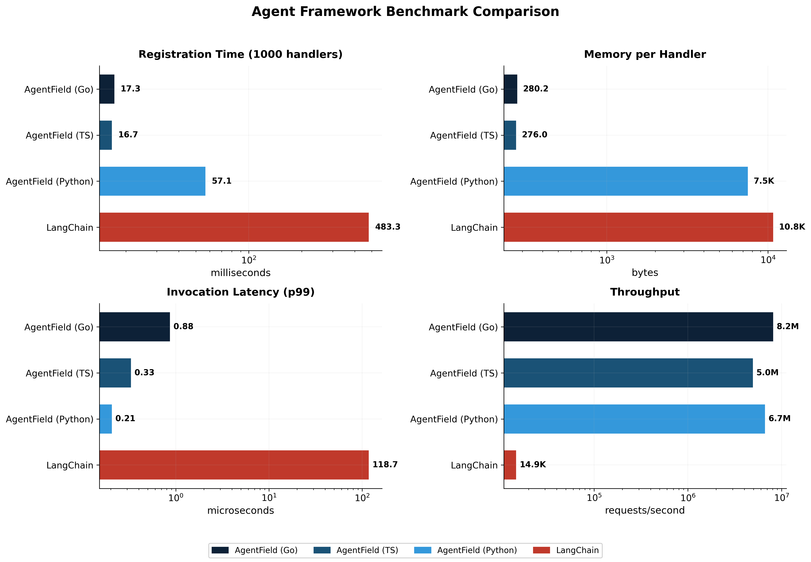

# Playground Scale Benchmark

A rigorous, reproducible benchmark measuring agent framework performance at scale.

## Methodology

### What We Measure

| Metric | Description | Why It Matters |
|--------|-------------|----------------|
| **Handler Registration Time** | Time to register N handlers/tools | Startup latency for large agent systems |
| **Memory Footprint** | Heap allocation after registration | Infrastructure cost, deployment constraints |
| **Cold Start Time** | Process start → first request served | Serverless/autoscaling responsiveness |
| **Request Latency (p50/p95/p99)** | End-to-end request processing time | User-facing performance |
| **Throughput (RPS)** | Max sustainable requests/second | Capacity planning |
| **Memory Stability** | Memory growth over sustained load | Production reliability |

### Statistical Rigor

- **Multiple runs**: Each test runs 10+ iterations
- **Warm-up**: First 2 runs discarded to avoid JIT/cache effects
- **Percentiles**: Report p50, p95, p99 (not just mean)
- **Standard deviation**: Error bars on all measurements
- **Cold measurements**: Separate process per cold-start test

### Frameworks Tested

| Framework | Language | Version | Notes |
|-----------|----------|---------|-------|
| Playground Go SDK | Go 1.21+ | latest | Native Go implementation |
| Playground TypeScript SDK | Node.js 20+ | latest | Native TS implementation |
| Playground Python SDK | Python 3.12+ | latest | FastAPI-based |
| LangChain | Python 3.12+ | 0.1.x | StructuredTool-based |
| CrewAI | Python 3.12+ | latest | @tool decorator-based |
| Mastra | Node.js 20+ | latest | createTool-based |

### Workload Definition

**"Handler"**: A function that can process requests with:
- Input validation (JSON schema)
- Simple computation (no I/O, no LLM calls)
- Structured output

This isolates framework overhead from external dependencies.

## Running the Benchmarks

```bash
# Full benchmark suite
./run_benchmarks.sh

# Individual benchmarks
cd go-bench && go run .
cd python-bench && python benchmark.py
cd langchain-bench && python benchmark.py
cd crewai-bench && python benchmark.py
cd mastra-bench && npx tsx benchmark.ts
```

## Results

### Summary (Latest Run)

| Framework | Handlers | Registration | Memory | Memory/Handler | Latency p99 | Throughput |
|-----------|----------|--------------|--------|----------------|-------------|------------|
| Playground Go | 100,000 | 17.3 ms | 26.7 MB | 280 B | 1.0 µs | 8.2M req/s |
| Playground TS | 100,000 | 13.5 ms | 13.2 MB | 276 B | 0.25 µs | 4.0M req/s |
| Playground Python | 1,000 | 57 ms | 7.2 MB | 7.5 KB | 0.21 µs | 6.7M req/s |
| LangChain | 1,000 | 483 ms | 10.3 MB | 10.8 KB | 118 µs | 15K req/s |

**Python SDK Additional Metrics:**
- Agent Init: 0.98 ms (one-time overhead, no handlers)
- Agent Memory: 0.10 MB (one-time overhead)
- Cold Start: 0.82 ms (Agent + 1 handler)

### Normalized Comparison (1000 handlers)

| Metric | Playground Python | LangChain |
|--------|-------------------|-----------|
| Registration | 57 ms | 483 ms |
| Memory/Handler | 7.5 KB | 10.8 KB |
| Latency p99 | 0.21 µs | 118 µs |
| Cold Start | 0.82 ms | 0.67 ms |

### Registration Speed (extrapolated to 100K handlers)

| Framework | Time |
|-----------|------|
| Go | 17.3 ms |
| TypeScript | 13.5 ms |
| Playground Python | ~5,700 ms |
| LangChain | ~48,300 ms |

### Memory per Handler

| Framework | Memory/Handler |
|-----------|----------------|
| Go | 280 bytes |
| TypeScript | 276 bytes |
| Playground Python | 7.5 KB |
| LangChain | 10.8 KB |

### Throughput (single-threaded theoretical)

| Framework | Requests/sec |
|-----------|--------------|
| Go | 8.2M |
| Playground Python | 6.7M |
| TypeScript | 4.0M |
| LangChain | 15K |

### Visualization



See `results/` directory for raw data.

## Reproducing

```bash
# Prerequisites
go version  # >= 1.21
python3 --version  # >= 3.11

# Setup
cd examples/benchmarks/100k-scale
python3 -m venv venv
source venv/bin/activate
pip install -r requirements.txt

# Run
./run_benchmarks.sh
```

## Notes

### Handler Registration
Registration time measures the overhead of setting up handlers/tools. This matters for:
- Agent orchestration (routing between agents)
- Tool execution (non-LLM tools)
- High-frequency agent systems

### LLM Call Overhead
LLM latency dominates (100ms-10s). Framework overhead (0.1-10ms) is typically negligible for LLM-bound workloads.

### Comparison Fairness
All frameworks perform identical work: receive JSON, validate, compute, return JSON. No framework-specific optimizations applied.

### Memory Stability
Sustained load tests measure memory growth over time to detect leaks.
